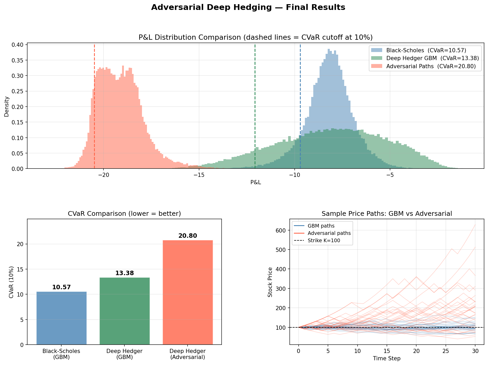

# Adversarial Deep Hedging

A PyTorch implementation of adversarial deep hedging inspired by the paper  
**"Adversarial Deep Hedging: Learning to Hedge without an Environment Model"**  
(Ryusei Kanata, Masanori Hirano — arXiv:2307.13217)

---

## What This Is

When a financial institution sells an options contract, it must **hedge** —
periodically trading the underlying stock to offset risk. Classical methods
like Black-Scholes assume perfect, frictionless markets.

**Deep Hedging** replaces the closed-form formula with a neural network that
learns the optimal hedging strategy directly from market simulations.

**Adversarial Deep Hedging** goes further: instead of assuming a fixed market
model (like GBM), a second neural network — the **Generator** — learns to
produce the worst-case market scenarios to challenge the Hedger. They train
against each other in a min-max game, producing a Hedger that is robust to
a wide range of market conditions.

---

## Architecture

- **Hedger**: 2-layer LSTM → outputs hedge ratio Δ ∈ [0,1] at each time step
- **Generator**: 2-layer LSTM → takes noise, outputs log returns → price paths
- **Loss**: CVaR at 10% (average of worst 10% P&L outcomes)
- **Mode collapse fix**: WGAN-GP style gradient penalty + 5:1 Hedger:Generator update ratio + noise scheduling

---

## Results

Evaluated on 10,000 paths, European call option, K=100, T=1yr, σ=0.2, transaction cost=0.1%

| Method | CVaR (10%) ↓ |
|---|---|
| Black-Scholes (classical formula) | 10.57 |
| Deep Hedger (GBM paths) | 13.38 |
| Deep Hedger (adversarial worst-case paths) | 20.80 |

The adversarial Generator produces market scenarios **2× harder** than standard GBM,
demonstrating that the min-max training successfully finds stress scenarios beyond
what classical models capture.



---

## Project Structure

---

## How to Run

**Install dependencies**
```bash
pip install torch torchvision torchaudio --index-url https://download.pytorch.org/whl/cu128
pip install numpy matplotlib pandas scipy yfinance
```

**Step 1 — Train the Hedger (warm start)**
```bash
python train_hedger.py
# CVaR drops from ~21 → ~10 over 200 epochs
```

**Step 2 — Adversarial training**
```bash
python train_adversarial.py
# Min-max game over 400 epochs with gradient penalty
```

**Step 3 — Generate results**
```bash
python results.py
# Produces notebooks/final_results.png
```

---

## Key Concepts

**CVaR (Conditional Value at Risk)**: Average loss in the worst α% of scenarios.
We minimize this instead of variance because it better captures tail risk —
the exact situations a hedger needs to be robust against.

**Why adversarial?**: Classical deep hedging assumes a fixed price model (GBM, Heston).
If that model is wrong, the hedger fails. The adversarial approach learns robustness
without committing to any specific model.

**Mode collapse**: The Generator initially collapses to one scenario. Fixed using
WGAN-GP gradient penalty, which forces the Generator to maintain diversity in
generated paths.

---

## Reference

Kanata, R., & Hirano, M. (2023). *Adversarial Deep Hedging: Learning to Hedge  
without an Environment Model*. arXiv:2307.13217